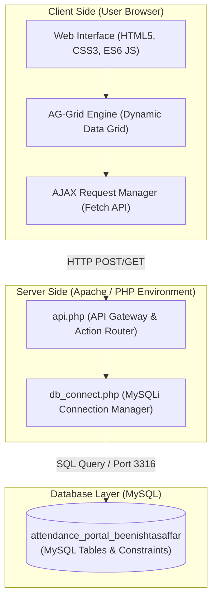
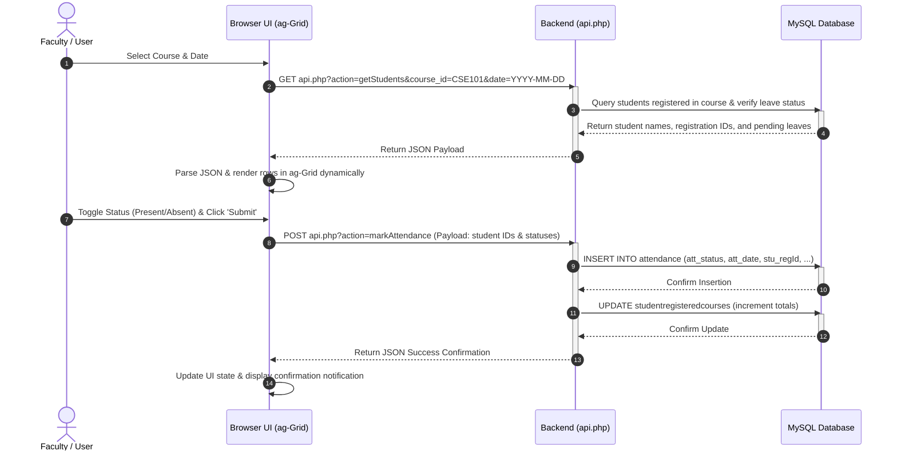
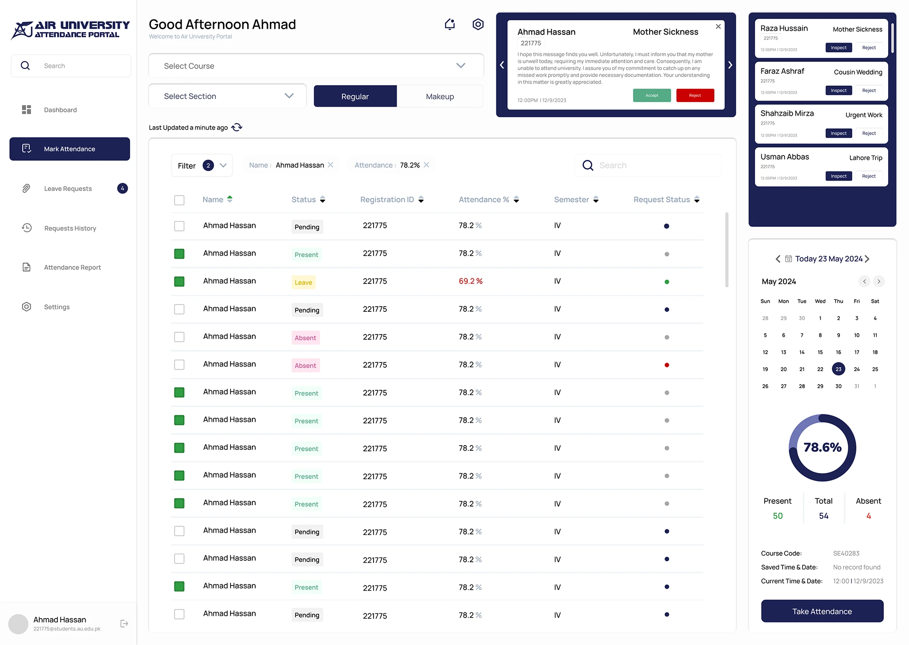

<p align="center">
  
</p>

<h1 align="center">Attendance & Leave Management Portal</h1>

<p align="center">
  <a href="https://github.com/AhmadHassan-BTed/Attendance-Portal-DataBase-Project"></a>
  <a href="https://php.net"></a>
  <a href="https://mysql.com"></a>
  <a href="https://developer.mozilla.org/en-US/docs/Web/JavaScript"></a>
</p>

<p align="center">
  <strong>Streamlining academic records, reducing administrative stress, and connecting students and educators through a reliable, human-centric database portal.</strong>
</p>

---

## 🌟 The Human Connection & Project Vibe

Behind every attendance entry, every percentage calculation, and every database row lies a human story. A classroom is not just a collection of registration IDs; it is a community of students pursuing their aspirations and teachers dedicating their expertise to guide them.

Traditional attendance marking is often tedious and error-prone, draining valuable class time and causing administrative anxiety for both parties. Students worry about record accuracy and leave approvals, while teachers bear the burden of tracking compliance across multiple classes.

This **Attendance & Leave Management Portal** was developed by **Ahmad Hassan (B-Ted)** to bridge this gap. By automating database updates and providing a clean, transparent interface, the administrative friction is minimized. This project is built on the belief that software should work for people—restoring focus to the learning experience and bringing peace of mind to the academic lifecycle.

---

## 🖥️ System Preview & UI Overview

The interface prioritizes clarity, utilizing a structured sidebar, real-time statistics cards, and a modern data grid to display student records.

<p align="center">
  
  <br />
  <em>Figure 1: The primary Teacher Portal Dashboard displaying student lists, attendance percentages, and current leave application statuses.</em>
</p>

---

## 📐 Architecture Overview

The portal implements a classic **Client-Server Architecture** optimized for local deployment and low latency. The frontend client communicates with the server via structured HTTP requests, utilizing an asynchronous AJAX pipeline for dynamic view updates.



---

## 🔄 System Workflow & Request Lifecycle

The system utilizes an asynchronous api-action routing system. Below is the step-by-step Request/Response Lifecycle representing how attendance is fetched, rendered, and recorded.



---

## 🗄️ Relational Database Schema

The core database design is modeled to reflect real-world university relationships: Departments house Courses; Teachers teach registered Courses; Students register for Courses; and Attendance is logged against daily classes, with optional references to Leave Applications.

<p align="center">
  
  <br />
  <em>Figure 2: Relational Schema showing primary/foreign key connections and referential constraints in phpMyAdmin.</em>
</p>

### Database Table Glossary

| Table Name | Description | Key Column | Foreign Keys |
| :--- | :--- | :--- | :--- |
| `students` | Stores student biographical and batch details. | `stu_regId` | None |
| `teachers` | Stores faculty profiles. | `th_regId` | `dep_id` → `department.dep_id` |
| `courses` | Catalog of academic courses. | `course_id` | `department_id` → `department.dep_id` |
| `department` | Details of academic departments. | `dep_id` | None |
| `login` | Teacher authentication credentials. | None | `th_regId` → `teachers.th_regId` |
| `studentregisteredcourses` | Maps student course enrollment and records total presence. | None | `stu_regId`, `course_id` |
| `teacherregisteredcourses` | Maps teacher course assignments and tracks classes taken. | None | `th_regId`, `course_id` |
| `attendance` | Main transaction log of daily student attendance status. | `att_id` (Auto-Increment) | `course_id`, `th_regid`, `stu_regId`, `leave_id` |
| `leave_application` | Log of student leave submissions and approval states. | `leave_id` (Auto-Increment) | `stu_regId`, `course_id` |

---

## 💾 Core SQL Operations

All database interactions are protected via Prepared Statements. Below is a collection of the primary queries driving the system.

<details>
<summary><b>1. User Authentication (Login)</b></summary>

```sql
SELECT th_regId 
FROM login 
WHERE l_username = ? 
  AND l_password = ?;
```
</details>

<details>
<summary><b>2. Student Dashboard Listing</b></summary>

Calculates active attendance percentage, active semester based on batch, and merges leave application status:

```sql
SELECT 
    s.stu_name,
    src.stu_regId,
    ROUND((src.src_totalPresent / trc.trc_totalClassesTaken) * 100, 2) AS attendance_percentage,
    (2026 - s.stu_batch) AS semester,
    COALESCE(la.request_status, 'No Request') AS requestStatus
FROM studentregisteredcourses src
JOIN students s ON s.stu_regId = src.stu_regId
JOIN teacherregisteredcourses trc 
    ON trc.course_id = src.course_id 
   AND trc.th_regId = ?
LEFT JOIN leave_application la 
    ON la.stu_regId = s.stu_regId 
   AND la.course_id = src.course_id 
   AND la.leave_date = ?
WHERE src.course_id = ?;
```
</details>

<details>
<summary><b>3. Unmarked Teacher Courses Lookup</b></summary>

Finds assigned courses for which attendance has not yet been submitted on a specific date:

```sql
SELECT 
    c.course_id,
    CONCAT(c.course_id, ' - ', c.course_name) AS course_info
FROM teacherregisteredcourses trc
JOIN courses c ON c.course_id = trc.course_id
LEFT JOIN attendance a 
    ON a.course_id = trc.course_id 
   AND a.att_date = ?
WHERE trc.th_regId = ?
  AND a.course_id IS NULL;
```
</details>

<details>
<summary><b>4. Attendance Marking Transaction</b></summary>

Logs the record and updates cumulative totals for both teacher lectures and student presence:

```sql
-- Step A: Log individual attendance record
INSERT INTO attendance (
    course_id, th_regid, att_status, att_date, 
    att_timerecorded, att_type, stu_regId, leave_id
) VALUES (?, ?, ?, ?, ?, ?, ?, ?);

-- Step B: Increment cumulative total classes taken by the teacher
UPDATE teacherregisteredcourses
SET trc_totalClassesTaken = trc_totalClassesTaken + 1
WHERE th_regId = ? AND course_id = ?;

-- Step C: Increment student present total (only executed if status is 'Present')
UPDATE studentregisteredcourses
SET src_totalPresent = src_totalPresent + 1
WHERE stu_regId = ? AND course_id = ?;
```
</details>

---

## 📂 Repository Structure

The directory organization is configured to keep assets, backend logic, stylesheets, and DB scripts separated cleanly:

```text
├── css/                                  # Application Stylesheets
│   ├── App.css                           # Global dashboard layout
│   ├── login.css                         # Custom styling for credentials screen
│   ├── portal.css                        # UI components & side navigation
│   └── register.css                      # Registration views
├── docs/
│   └── assets/                           # Presentation visuals & diagrams
│       ├── database_erd.webp             # Relational Database Schema
│       ├── portal_dashboard.webp         # Teacher Portal Screenshot
│       └── project_banner.webp           # Behance Presentation Header Banner
├── images/                               # Web interface image assets
│   ├── google_logo.png
│   ├── login_background.jpg
│   ├── logo.png
│   └── unilogo.jpg
├── Attendance and Leave Management Portal...docx # Full project document
├── Attendance and Leave Management Portal...pdf  # PDF copy of report
├── api.php                               # Application API Gateway & Action Router
├── attendanceReport.php                  # Attendance summary views
├── attendance_portal_beenishtasaffar.sql # Database schema dump
├── dashboard.php                         # Dashboard interface file
├── db_connect.php                        # Database connection settings
├── index.php                             # System entrypoint (redirects to login)
├── leaveRequests.php                     # Leave application listing page
├── login.php                             # Teacher login screen logic
├── logout.php                            # Destroys sessions & logs out
├── portal.php                            # Core layout interface & data grid
├── register.php                          # Teacher registration logic
├── requestsHistory.php                   # Historic logs for leave applications
├── sidebar.php                           # Side navigation include
├── test_db.php                           # Connection testing script
└── web project demo.mp4                  # Dynamic video walkthrough
```

---

## ⚙️ Build & Deployment Pipeline

Running the portal locally requires the standard XAMPP package (Apache & MySQL).

### Prerequisite Steps
1. Download and install **XAMPP** (PHP 8.0+ / MariaDB).
2. Clone this repository to local machine.

### Configuration
1. Open the XAMPP Control Panel.
2. Ensure the MySQL configuration is running on Port `3316`. *(Note: If standard port `3306` is preferred, open [db_connect.php](db_connect.php) and change the port configuration in the connection statement)*.
3. Start the Apache and MySQL services.

### Database Setup
1. Open `http://localhost/phpmyadmin` in web browser.
2. Create a new database named `attendance_portal_beenishtasaffar`.
3. Click the **Import** tab.
4. Select the database dump file: `attendance_portal_beenishtasaffar.sql`.
5. Click **Import** at the bottom to build the schema tables and insert seed data.

### Running the App
1. Move the repository folder into the `htdocs` directory of local XAMPP installation (typically `C:\xampp\htdocs\Attendance-Portal-DataBase-Project`).
2. Access the application in browser: `http://localhost/Attendance-Portal-DataBase-Project/`.

---

## 🤝 Development & Contribution Guidelines

This repository was designed and engineered by **AhmadHassan-BTed (Ahmad Hassan)**. 

To maintain clean repository standards, new contributions are welcomed under the following conditions:
* Branches should be named descriptively (e.g. `feature/attendance-alerts`).
* Code formatting should follow standard PHP PSR-12 guidelines.
* Pull requests must be fully documented, stating what adjustments were made and linking back to the relevant system flow or module.
* Collaborative feedback and UI designs are contributed in partnership with **Nimra Marrium**.

